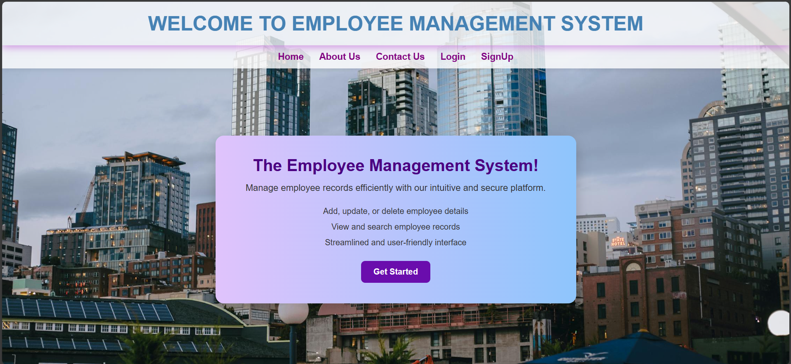
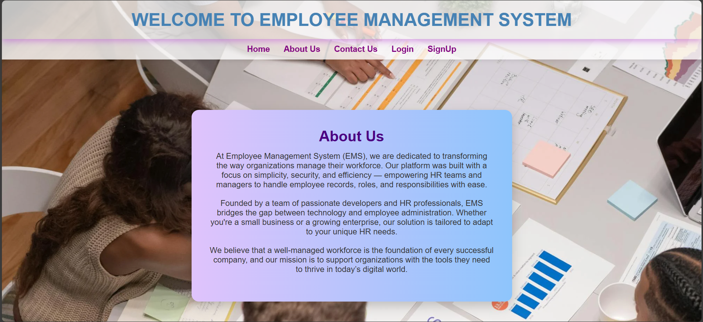
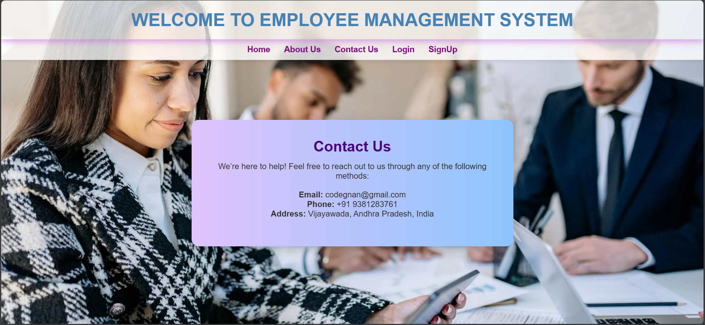
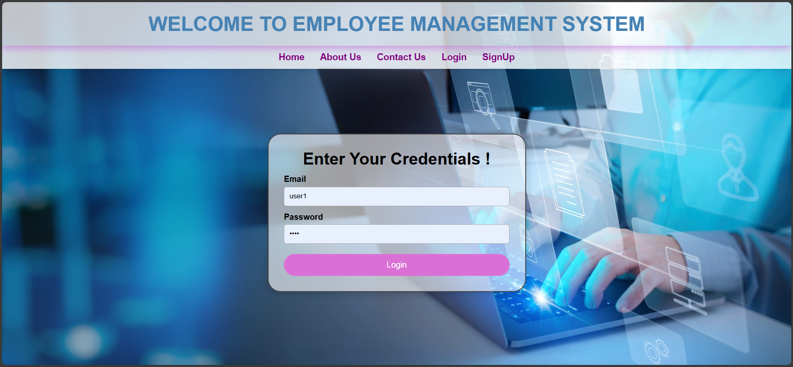
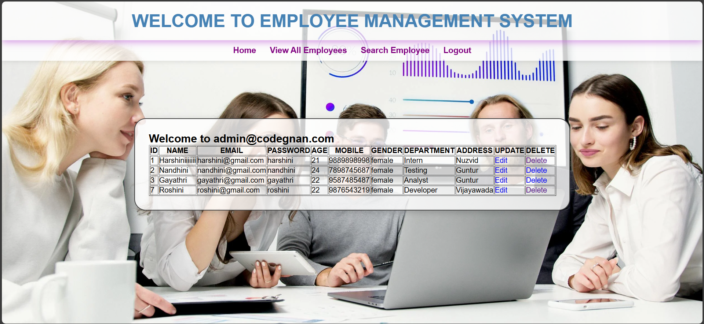
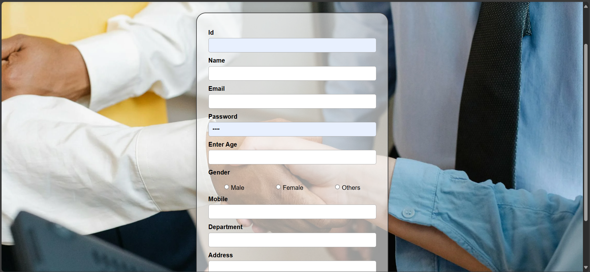
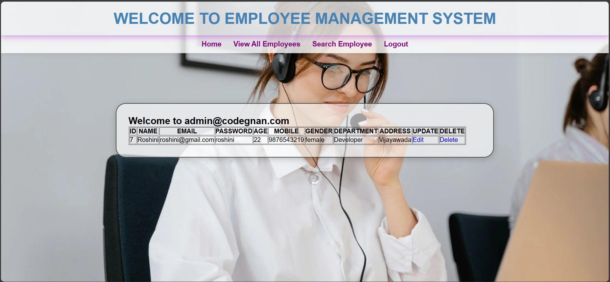

# 👨‍💼 Employee Management System (Java EE)

A role-based web application built using **Java Servlets**, **JSP**, and **JDBC** for managing employee records with separate access for Admins and Employees.

## 🎥 Live Demo

📽️ **Watch the Project in Action:**  
[👉 Click here to view the demo on Google Drive](https://drive.google.com/file/d/1pZjE7_44tQhilh0dX2uuQRoaIHCuqenm/view?usp=sharing)


## 📌 Features

### 🔐 Login Module
- **Admin Login**
  - Hardcoded credentials: `admin@codegnan.com` / `password**`
  - Redirects to admin dashboard
- **Employee Login**
  - Validated against database records
  - Redirects to personal profile

### 👨‍💼 Admin Panel
- View all employees
- View single employee details
- Update employee information
- Delete employee records

### 👷 Employee Panel
- View personal profile
- Update own details
- Cannot delete or view other employees

### 📄 Additional Pages
- **About Us** – Overview of the company
- **Contact Us** – Contact information for support or inquiries

---

## 🛠️ Tech Stack

| Technology     | Description                        |
|----------------|------------------------------------|
| Java           | Core application logic (Servlets)  |
| JSP            | Frontend pages                     |
| JDBC           | Database connectivity              |
| MySQL          | Backend database (assumed)         |
| Eclipse IDE    | Development environment            |
| Apache Tomcat  | Local server for deployment        |

---

---
## 📸 Screenshots
###  Home Page


### 📄 About Us


### 📄 Contact Us


### 🔐 Login Page


### 🛠️ Admin Panel


### ✏️ All Employee Details


### 🔐 SignUp Page


### 👷 View Employee



## 🧪 How to Run

1. Clone the repository:
   ```bash
   git clone https://github.com/your-username/employee-management-system.git
2. Open the project in Eclipse IDE.

3. Configure Apache Tomcat server in Eclipse.

4. Import your MySQL database schema and update DB credentials in DAO files.

5. Run the project on the server and access it via:
   ```bash
   http://localhost:8080/EmployeeManagementSystem/

## 💡 Future Improvements
Add password encryption for login

Implement pagination for large employee lists

Add role creation module for HR or Manager roles

RESTful API support

## 📞 Contact
Created by Roshini Yajjavarapu
Let’s connect on LinkedIn(https://www.linkedin.com/in/roshini-y-291905253/) 🤝
